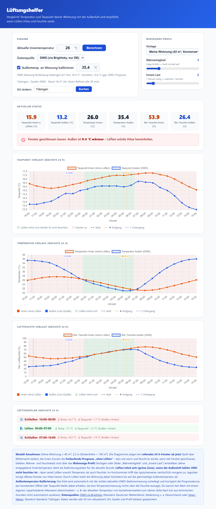

# Lüftungshelfer

[](https://github.com/mcamen/mclueften/actions/workflows/ci.yml)

**Live-Demo: https://mcamen.github.io/mclueften/**

Eine kleine Single-Page-Web-App, die abschätzt, **wann sich Lüften lohnt** – um im Sommer Hitze und Feuchte aus der Wohnung zu bekommen. Sie vergleicht das modellierte Innenklima („ohne Lüften") mit der Außenluft und empfiehlt für die nächsten 24 Stunden, wann Fenster auf bzw. zu sollten. Läuft komplett im Browser, ohne Backend.

## Screenshot



## Funktionen

- **Lüften-Empfehlung** je Stunde: grün, wenn die Außenluft **kühler UND nicht feuchter** ist (senkt dann Temperatur *und* Feuchte), sonst „Fenster zu". Basiert auf Taupunkt (Feuchte) *und* Temperatur.
- **Rollendes 24-h-Fenster** ab der aktuellen Stunde (läuft über Mitternacht weiter) – für Taupunkt- und Temperaturverlauf sowie einen Lüftungsplan.
- **Sonnenauf- und -untergang** als Markierung in den Diagrammen (lokal berechnet).
- **Live-Wetterdaten** aus zwei Quellen: **DWD** (über [Brightsky](https://brightsky.dev), Standard, v. a. Deutschland) oder [Open-Meteo](https://open-meteo.com). Standort-Standard: Tübingen, beliebiger Ort per Suche.
- **Kalibrierung** der Außentemperatur auf eine echte Messung: automatisch mit der aktuellen DWD-Stationsmessung vorbelegt, manuell überschreibbar (Offset-Korrektur, Taupunkt bleibt erhalten).
- **Einstellbares Wohnungs-Profil** (Vorlagen + Slider für Wärmeträgheit und innere Last).
- Ort, Quelle und Profil bleiben gespeichert (localStorage); Daten werden alle 30 min aktualisiert.

## Nutzung

Einfach `index.html` im Browser öffnen – Live-Wetterdaten werden automatisch geladen (Standard-Standort: Tübingen). Aktuelle Innentemperatur eingeben und ggf. das Wohnungs-Profil anpassen.

## Modell (Kurzfassung)

Die Innen-Kurven sind eine **freilaufende Prognose „ohne Lüften"**: Sie zeigen, wie warm und feucht es würde, wenn die Fenster geschlossen blieben (Person/Geräte als Wärme- und Feuchtequelle, gedämpfte Kopplung an außen). Lüften lohnt sich dort, wo die Außenluft dieses Innenklima verbessert. Durch Lüften kühlt die Wohnung höchstens bis auf die gleichzeitige Außentemperatur ab. Alle Werte sind Schätzungen – die eingegebene Innentemperatur und die optionale Außentemperatur-Messung dienen als Kalibrierungsanker.

## Technik

- Einzelne `index.html` (HTML/CSS/JS), kein Backend
- [Chart.js](https://www.chartjs.org/) für die Diagramme
- Wetterdaten: [Brightsky](https://brightsky.dev) (DWD) und [Open-Meteo](https://open-meteo.com)

### Entwicklung

Das Inline-JavaScript lässt sich mit ESLint prüfen:

```bash
npm install
npm run lint
```

## Lizenz

[MIT](LICENSE) – frei nutz-, veränder- und weiterverteilbar; einfach den Copyright-Hinweis erhalten.
